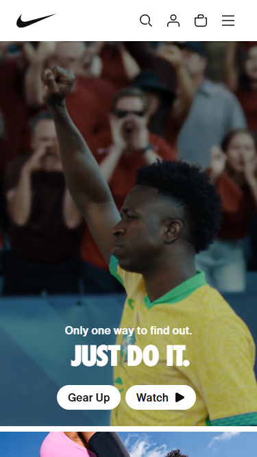

# Procesverslag
Markdown is een simpele manier om HTML te schrijven.  
Markdown cheat cheet: [Hulp bij het schrijven van Markdown](https://github.com/adam-p/markdown-here/wiki/Markdown-Cheatsheet).

Nb. De standaardstructuur en de spartaanse opmaak van de README.md zijn helemaal prima. Het gaat om de inhoud van je procesverslag. Besteedt de tijd voor pracht en praal aan je website.

Nb. Door *open* toe te voegen aan een *details* element kun je deze standaard open zetten. Fijn om dat steeds voor de relevante stuk(ken) te doen.

## Jij

  
uitwerken voor kick-off werkgroep

  ### Auteur:
  Yaël Markus

  #### Je startniveau:
  blauw

  #### Je focus:
  responsive
 

## Je website

  
uitwerken voor kick-off werkgroep

  ### Je opdracht:
  nike.com
  #### Screenshot(s) van de eerste pagina (small screen): 
  hier de naam van de pagina  
  

  #### Screenshot(s) van de tweede pagina (small screen):
  hier de naam van de pagina  
  
 

## Toegankelijkheidstest 1/2 (week 1)

  
uitwerken na test in 2e werkgroep

  ### Bevindingen
  Lijst met je bevindingen die in de test naar voren kwamen:

  De screenreader van nike werkte erg goed.
  Links werden duidelijk aan gegeven, kopjes waren duidelijk aangegeven. Je kon overal makkelijk doorheen tabben.
  Gebruikt h1, h2, etc.

  Ook werkt de website heel goed op telefoon formaat.

  De css heeft wel heel veel errors.

  De website gebruikt geen list elements

  Alle foto's hebben een alt

  De video op de home page speelt automatisch af, maar heeft wel controls om dit op pauze te zetten. Maar op telefoon formaat werken deze controls niet.

  De website heeft geen skip link

  De website support geen light/dark mode

  Reduced motion query is er niet, maar er zijn ook geen animaties waar dit nodig voor is

  De text valt soms weg in de images en ::selection is afwezig in de site

## Breakdownschets (week 1)

  
uitwerken na afloop 3e werkgroep

  ### de hele pagina: 
  

  ### dynamisch deel (bijv menu): 
  

  ### wellicht nog een dynamisch deel (bijv filter): 
  

## Voortgang 1 (week 2)

  
uitwerken voor 1e voortgang

  ### Stand van zaken
  hier dit ging goed & dit was lastig (neem ook screenshots op van delen van je website en code)

  ### Agenda voor meeting
  samen met je groepje opstellen

  | Yaël Markus    | Casper Kroon       | Joep Smit    | -                |
  | ---            | ---                | ---          | ---              |
  | hoe werkt een  | hoe maak je een    | uitleg over  |                  |
  | hamburgermenu  | searchbar          | @font-face   |                  |
  | ...            | ...                | ...          | ...              |

  ### Verslag van meeting
  - Geleerd dat je summary tags kan gebruiken voor dropdown menu's
  - Hoe je een search bar maakt, search input html (mozilla.org)
  - Hamburger menu maak je met een button
  - Uitleg over @font-face
  - Uitleg over grid en flexbox

## Voortgang 2 (week 3)

  
uitwerken voor 2e voortgang

  ### Stand van zaken
  hier dit ging goed & dit was lastig (neem ook screenshots op van delen van je website en code)

  ### Agenda voor meeting
  samen met je groepje opstellen

  | Joep Smit      | Yaël Markus        | Casper Kroon | -                |
  | ---            | ---                | ---          | ---              |
  | Navbar en ham  | Navbar             | Hamburger    |                  |
  | burger menu    |                    | menu         |                  |
  | ...            | ...                | ...          | ...              |

  ### Verslag van meeting
  hier na afloop snel de uitkomsten van de meeting vastleggen

  - JS gebruiken voor de verschijnende navbar
  - grid gebruiken voor de afbeelding met tekst erop
  - nog een punt
- ...

## Toegankelijkheidstest 2/2 (week 4)

  
uitwerken na test in 9e werkgroep

  ### Bevindingen
  Lijst met je bevindingen die in de test naar voren kwamen (geef ook aan wat er verbeterd is):

  Mijn versie heeft 0 errors bij de w3c validation, alleen die van de markers voor de carousel, maar deze kreeg ik niet weg zonder dat de markers weg gingen.

  Ik heb list elements toegevoegd aan de website voor een duidelijker overzicht

  Mijn video speelt niet automatisch af, deze kan je door middel van een knop aan en uit zetten. De knop werkt zowel op klein als op groot formaat.

  Ik heb een skip link button toegevoegd, zodat de gebruiker gelijk naar de main content kan skippen.

  Ook heb ik light/dark mode toegevoegd aan de site

  Ik heb geen reduced motion query gebruikt, want ik heb geen animaties toegevoegd aan de site

  Ook heb ik geen contrast check gedaan op mijn eigen site, het probleem van de de text soms een beetje weg valt op afbeeldingen is er dus nog steeds.

Op mijn website deed de screenreader het prima, net zoals op de echte nike website. Het enige waar ik wel beter over had kunnen nadenken was het gebruik van de header elements. Ik heb ze iets te veel gebruikt, waardoor de screenreader onnodig door de header elementen moest, ik had van sommige beter paragraph elements kunnen maker, zodat een gebruiker er vlotter doorheen kon navigeren bij het gebruik van een screenreader.

## Voortgang 3 (week 4)

  
uitwerken voor 3e voortgang

  ### Stand van zaken
  hier dit ging goed & dit was lastig (neem ook screenshots op van delen van je website en code)

  ### Agenda voor meeting
  samen met je groepje opstellen

  | Joep Smit      | Casper Kroon       | Yaël Markus  | student 4        |
  | ---            | ---                | ---          | ---              |
  | hamburger menu | responsiveness     | grid         | en dan ik dat    |
  | foto overlay   |                    |              | dit wil ik zeker |
  | input element  | ...                | ...          | ...              |

  ### Verslag van meeting
  hier na afloop snel de uitkomsten van de meeting vastleggen

  - Ik heb beter geleerd hoe ik grid kan gebruiken
  - Ik heb meer geleerd over het hamburgermenu
  -
  - ...

## Eindgesprek (week 5)

  
uitwerken voor eindgesprek

  ### Je uitkomst - karakteristiek screenshots:
  
  
  
  

  ### Dit ging goed/Heb ik geleerd: 
  Ik heb meer over grid en flexbox geleerd en mijn basis is beter geworden. Ook heb ik meer over javascript geleerd. Ook heb ik geleerd over hoe ik images beter responsive kan maken, door middel van clamps. Ik heb dus veel geleerd over responsiveness.
  
  

  ### Dit was lastig/Is niet gelukt:
  Ik vond het responsive maken nog best wel lastig, maar met hulp van Sanne, studentassistenten en klasgenoten is het goed gekomen. Ook was het toevoegen van de carousel buttons op de manier hoe nike het deed moeilijk. ik kreeg de buttons niet goed in positie, dus ik heb dit overgeslagen. Uiteindelijk heeft Sanne dit voor mij gedaan in het eindgesprek, dus is het alsnog een soort van gelukt!

  
  

## Bronnenlijst

  
continu bijhouden terwijl je werkt

  Nb. Wees specifiek ('css-tricks' als bron is bijv. niet specifiek genoeg). 
  Nb. ChatGpT en andere AI horen er ook bij.
  Nb. Vermeld de bronnen ook in je code.

  1. https://utopia.fyi/clamp/calculator?a=960,1669,356.7%E2%80%94668.75 voor responsiveness
  2. Melissa
  3. Julian 
  4. Sanne 
  5. https://developer.mozilla.org/en-US/ voor meerdere dingen
  6. chatgpt voor een klein stukje javascript
  7. https://codepen.io/shooft/pen/MYKjaXd?editors=0110 voor de video
  8. https://codepen.io/Ya-l-Markus/pen/ByjmJyM voor grid

